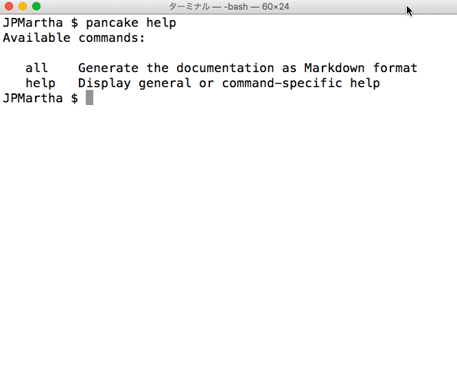

# Pancake (Coming soon)

This is a command line program to be run on OS X's Terminal utility that performs generating a Swift documentation as Markdown format.

It's depended on [SourceKittenFramework](https://github.com/jpsim/SourceKitten).



## Installing Pancake

Please download the `Pancake.pkg` file in the [Releases](https://github.com/JPMartha/Pancake/releases) page and run it.

## Getting Started

1. Change directory to your project directory on `Terminal.app`.
2. Run `$ pancake all --scheme YourSchemeName`.

Generate the documentation as Markdown format in `./Pancake/Documentation` directory.

#### Example

If your project is in `./Source/DemoKit` directory and the scheme name is `DemoKit`, please run the following commands.

1. Run `$ cd ./Source/DemoKit`
2. Run `$ pancake all --scheme DemoKit`

Generate files in [`./Pancake/Documentation`](https://github.com/JPMartha/Pancake/tree/kanmoba/Sources/DemoKit/Pancake/Documentation) directory.

## Available Commands

```
$ pancake help
Available commands:

   all    Generate the documentation as Markdown format
   help   Display general or command-specific help
```

## Availability

- OS X 10.0 and later
- Xcode 7.0 and later

## License

__Pancake__ is released under the [MIT License](LICENSE).
